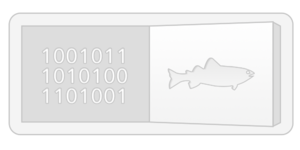

code-to-cod plus plus
=============

Chrome extension that replaces occurrences of 'code' with 'cod', and a few other cod related things...

[Direct download of crx file](https://github.com/mkoryak/code-to-cod/blob/master/CodeToCod.crx?raw=true)

Installation
------------

In Chrome, choose Window > Extensions.  Drag CodeToCod.crx into the page that appears.

Original Version
--------------

Can be found here: https://github.com/panicsteve/cloud-to-butt/